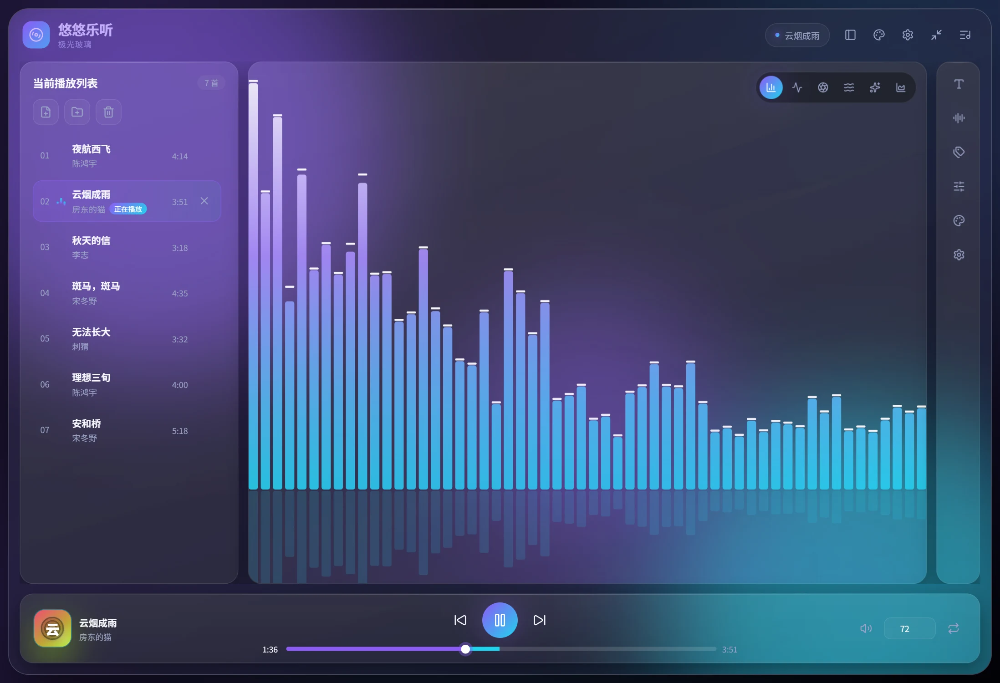

<div align="center">


# 悠悠乐听

**把本地音乐听成一场演出**

本地优先的跨平台桌面音乐播放器 —— 六种实时音频可视化、四套现代玻璃拟态皮肤、十段均衡器。
基于 Tauri 2 + React 19 + Rust，全部离线运行，不需要登录。

[](LICENSE)
[](https://github.com/ijry/YoYoMusic/releases/latest)
[](https://github.com/ijry/YoYoMusic/actions/workflows/ci.yml)
[](https://ijry.github.io/YoYoMusic/)

[文档站](https://ijry.github.io/YoYoMusic/) ·
[下载最新版](https://github.com/ijry/YoYoMusic/releases/latest) ·
[问题反馈](https://github.com/ijry/YoYoMusic/issues)

</div>



## 特性

- **六种实时音频可视化** —— 频谱柱、示波波形、环形律动、音浪绸带、粒子星尘、镜像瀑布。
  舞台右上角一键切换，右侧面板里有完整列表。信号由曲目 id 播种，每首歌都有稳定的专属律动。
- **四套现代玻璃拟态皮肤** —— 极光玻璃、午夜霓虹、落日熔金、薄荷录音室。共享同一套布局，
  只切换配色 token，换皮肤不会打乱操作习惯，皮肤同时驱动可视化配色。
- **十段均衡器** —— 内置平直、摇滚、流行、人声四组预设，也可逐段手动微调。
- **歌词与桌面歌词** —— 主窗口滚动歌词自动高亮，另有可点击穿透的桌面歌词浮窗与迷你播放器。
- **本地曲库** —— 文件/文件夹导入、内嵌标签读写、封面引用、四种播放模式与自动连播。
- **本地优先** —— 解析、解码、播放全部在本机完成，不联网、不上传、不需要账号。
- **全局快捷键** —— 默认 `Ctrl+Alt+P` 播放暂停、`Ctrl+Alt+←/→` 切歌，可在设置中修改。
- **三平台** —— Windows、macOS（含 Apple Silicon）与 Linux。

## 界面

界面分成四个区域，其中三个可以按需收起，把空间让给可视化：

| 区域 | 内容 |
| --- | --- |
| 左栏 | 播放列表，可通过顶栏按钮整体收起 |
| 中间 | 可视化舞台，独占全部剩余空间 |
| 右栏 | 功能图标栏，**默认收起**，点图标展开对应面板，再点一次收起 |
| 底部 | 播放控制条：封面与曲目信息、播放控制、进度、音量与播放模式 |

右侧功能面板包含：歌词、可视化、标签、均衡器、皮肤、设置。

### 可视化模式

| 模式 | 特点 |
| --- | --- |
| 频谱柱 | 镜像频谱条，带峰值保持标记与地面倒影 |
| 示波波形 | 发光示波曲线，叠加刻度网格与中心基准线 |
| 环形律动 | 环形放射律动，内核随低频脉动、整体缓慢旋转 |
| 音浪绸带 | 四层叠加的流动音浪，用加色混合叠出光带 |
| 粒子星尘 | 节拍驱动的粒子爆发，核心有脉动光环 |
| 镜像瀑布 | 滚动频谱瀑布，左半镜像到右半 |

### 皮肤

| 皮肤 | 色调 |
| --- | --- |
| 极光玻璃 | 紫罗兰 → 青（默认） |
| 午夜霓虹 | 品红 → 蓝紫 |
| 落日熔金 | 橙 → 金 |
| 薄荷录音室 | 薄荷绿 → 天蓝 |

除内置皮肤外，也可以在「皮肤」面板导入皮肤包目录，程序会校验 manifest 后再应用。

## 安装

从 [Releases](https://github.com/ijry/YoYoMusic/releases/latest) 下载对应平台的安装包：

| 平台 | 文件 |
| --- | --- |
| Windows 10/11 | `*_x64-setup.exe`（NSIS）或 `*_x64_zh-CN.msi` |
| macOS | `*.dmg`（Apple Silicon 与 Intel 通用） |
| Linux | `*.deb` 或 `*.AppImage` |

> [!IMPORTANT]
> 安装包未做代码签名。macOS 首次打开请右键点击图标 → 选择「打开」；Windows 若被 SmartScreen 拦截，
> 点击「更多信息」→「仍要运行」。Linux 的 AppImage 需要先 `chmod +x`。

详细的安装说明与系统要求见[文档站的安装页](https://ijry.github.io/YoYoMusic/guide/installation.html)。

## 从源码构建

需要 Node.js 22+、Rust 1.77+，以及对应平台的 [Tauri 系统依赖](https://tauri.app/start/prerequisites/)。

```bash
git clone https://github.com/ijry/YoYoMusic.git
cd YoYoMusic
npm install
npm run tauri dev      # 开发模式
npm run tauri build    # 构建安装包，产物在 src-tauri/target/release/bundle/
```

## 开发

```bash
npm run dev            # 只跑前端（浏览器模式，无音频与本地文件访问）
npm test               # 前端单元测试（Vitest）
npm run build          # 类型检查 + 生产构建
npx oxlint src         # 静态检查
cargo test --manifest-path src-tauri/Cargo.toml
```

文档站：

```bash
cd docs-site
npm install
npm run docs:dev
```

### 项目结构

```
src/
  App.tsx                主窗口：状态、事件订阅、命令分发
  shared/                跨 feature 复用的类型、图标、封面、工具
  features/
    player/              播放状态机与底部播放条
    playlist/            播放列表
    visualization/       可视化引擎（信号 + 绘制 + 画布组件）
    skin/                皮肤注册表、布局、面板框架
    lyrics/  equalizer/  tags/  settings/  mini/  shell/
  styles/                theme.css / app.css / skin-layouts.css
src-tauri/               Rust 侧命令与播放服务
docs-site/               VitePress 文档站
```

架构细节（皮肤 token 约定、可视化信号引擎、布局约束）见[文档站](https://ijry.github.io/YoYoMusic/dev/architecture.html)。

## 发布流程

推送 `v*.*.*` 形式的标签即可触发发布：校验三处版本号一致 → 三端构建安装包 → 发布 GitHub Release。
标签的正文会原样成为 Release 说明。完整步骤见[发布流程](https://ijry.github.io/YoYoMusic/dev/release.html)。

## 许可

本项目以 **GNU Affero General Public License v3.0 or later** 发布，详见 [LICENSE](LICENSE)。

Copyright © 2026 xyito
